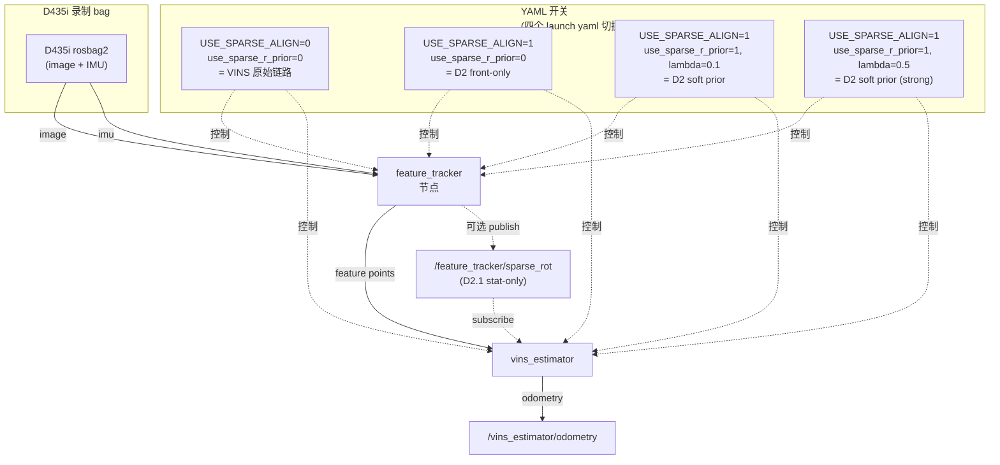
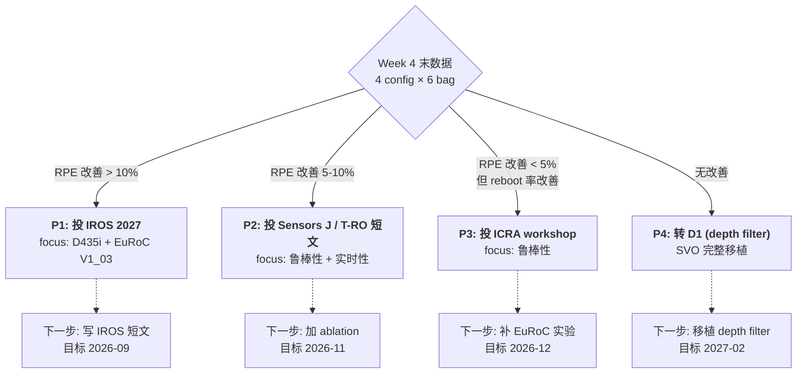

# D2 改进计划 — D435i 主线 + VINS 原始链路保留

> **生成时间**: 2026-06-16
> **执行基线**: phase 1 sparse align 已实现，本计划在 phase 1 改造线路上"叠加" D2 的 sparse R 进 BA 实验
> **目标产出**: 4 周拿到 IROS 短文 / Sensors J 级别的 paper-ready 数据
> **核心原则**: **VINS 原始链路完全保留**——4 个 launch yaml 切换 baseline vs D2，不复制代码、不破坏 phase 1

---

## 0. 计划执行基线（来自代码事实）

| 事实 | 证据 |
|---|---|
| VINS 原始链路"可关掉" | `USE_SPARSE_ALIGN` 是 `feature_tracker/src/parameters.cpp:121` 的 YAML 开关，默认 0——设 0 即回到 VINS-Mono 原版 |
| D435i 慢 bag 数据流 | `feature_tracker/src/feature_tracker_node.cpp:31-46` 收 IMU，`:107-118` 把 IMU 预积分 R 灌给 `setImuRotationPrior`——这条路径已经存在 |
| D2 接入点 | `feature_tracker/src/feature_tracker.cpp:198` `sparseAlign` 调用拿到的 `R_prev_cur_` 是 D2 的"现成 R"——0 改造即可拿到 |
| Ceres BA 入口 | `vins_estimator/src/estimator.cpp:672-720` `optimization()` 里有 `ceres::Problem`，`para_Pose[i]` 是 7 维块——加 sparse R 残差是标准 Ceres 操作 |
| D435i 已有 yaml | `config_pkg/config/realsense/realsense_d435i_config.yaml` 有 IMU/相机/外参等所有字段，需要补 `use_sparse_align` 等 |

**关键结论**：

> VINS 原始链路保留 = `USE_SPARSE_ALIGN=0`，D2 = `USE_SPARSE_ALIGN=1` + `USE_SPARSE_R_PRIOR=1`——两个 launch 文件即可分离。**不需要复制代码**。

---

## 1. 总体方案

### 1.1 架构图



### 1.2 四个 launch 配置

- `d435i_vins_baseline.yaml`：VINS 原始链路，sparse 全部关闭
- `d435i_d2_front.yaml`：D2 前端 only，sparse align 开启但 R 不进 BA
- `d435i_d2_soft_0.1.yaml`：D2 软先验 lambda=0.1
- `d435i_d2_soft_0.5.yaml`：D2 软先验 lambda=0.5

四个 launch 文件即可分离 baseline vs D2——**不复制代码**。

---

## 2. 4 周 WBS

### Week 1：stat-only 通道打通（D2.1）

**目标**：跑通 sparse R 跨节点 publish + subscribe，不接 BA——只做统计打印。

#### 2.1 Week 1 任务清单

| ID | 任务 | 关键文件 / 行 | 产出 |
|---|---|---|---|
| W1.1 | 新建 `SparseRot.msg` | `feature_tracker/msg/SparseRot.msg` (新建) | msg 定义 |
| W1.2 | feature_tracker publish sparse R | `feature_tracker/src/feature_tracker_node.cpp:19-22` 附近 + `:120-200` 段落 | `/feature_tracker/sparse_rot` topic |
| W1.3 | vins_estimator subscribe + 缓存 | `vins_estimator/src/estimator_node.cpp:22` 附近 | 内存里 `latest_sparse_R_` |
| W1.4 | 在 `processImage` 里统计 | `vins_estimator/src/estimator.cpp:120` 附近 | 日志打印 angle residual |
| W1.5 | 改 CMakeLists | `feature_tracker/CMakeLists.txt:8-37` + `vins_estimator/CMakeLists.txt` | rosidl 编译通过 |
| W1.6 | 新建 `d435i_d2.launch.py` | `feature_tracker/launch/` | launch 文件 |

#### 2.2 W1.1 msg 详细定义

新建 `feature_tracker/msg/SparseRot.msg`：

```
std_msgs/Header header
float64[9] R_matrix
bool success
float32 chi2
int32 n_meas
float64 stamp_sec
```

> 不用 ROS 2 geometry_msgs/Pose——避免依赖 PoseWithCovariance 的协方差矩阵那部分（D2 之后要加 3x3 信息矩阵，先打基础）。

#### 2.3 W1.2 publish 改造

在 `feature_tracker_node.cpp:19-22` 增加：

```cpp
rclcpp::Publisher<vins_sparse::msg::SparseRot>::SharedPtr pub_sparse_rot;
```

并增加 `sparse_rotation_callback()`，逻辑：

- 收 `align_res`（在 `readImage` 里）
- 写 `R_prev_cur_` 的 9 个元素到 `R_matrix`（行优先）
- `success = align_res.success`
- `chi2 = align_res.final_chi2`
- `n_meas = align_res.n_meas`
- `stamp_sec = img_msg->header.stamp.sec + img_msg->header.stamp.nanosec * 1e-9`
- **不成功 / n_meas < 30 不 publish**

**关键点**：W1.2 必须复用 `feature_tracker.cpp:198` 已算好的 `R_prev_cur_`——不要在 `feature_tracker_node.cpp` 重新算稀疏对齐。

#### 2.4 W1.3 subscribe 改造

在 `estimator_node.cpp`：

- 加一个 `Subscriber<vins_sparse::msg::SparseRot>` 接 `/feature_tracker/sparse_rot`
- 缓存到 `static Eigen::Matrix3d latest_sparse_R_; static double latest_sparse_t_; static bool have_sparse_R_ = false;`
- 不在回调里做任何 BA 相关操作——只缓存

#### 2.5 W1.4 stat log 改造

在 `estimator.cpp:processImage` 末尾加：

```cpp
if (have_sparse_R_ && abs(header.stamp.sec + header.stamp.nanosec*1e-9 - latest_sparse_t_) < 0.05) {
    Eigen::Matrix3d R_imu = pre_integrations[frame_count]->delta_q.toRotationMatrix();
    Eigen::Matrix3d R_diff = latest_sparse_R_.transpose() * R_imu;
    Eigen::AngleAxisd aa(R_diff);
    double angle_deg = aa.angle() * 180.0 / M_PI;
    if (++n_sparse_stat_ % 10 == 0) {
        RCUTILS_LOG_INFO("[D2_STAT] sparse_R vs IMU_R angle=%.3f deg chi2=%.1f n_meas=%d",
                         angle_deg, last_sparse_chi2_, last_sparse_n_meas_);
    }
}
```

`n_sparse_stat_` 是 Estimator 类的成员（新增）。

#### 2.6 W1.6 launch 拆分

新建 `d435i_d2.launch.py`：

- 与 `d435i.launch.py` 完全相同
- 唯一区别：在参数里设 `use_sparse_align: 1`

`d435i_baseline.launch.py`：

- 复制 `d435i.launch.py`
- 设 `use_sparse_align: 0`

> 不需要改 `d435i.launch.py` 本体——避免破坏 phase 1 的 launch。

#### 2.7 Week 1 风险

| 风险 | 概率 | 对策 |
|---|---|---|
| `rosidl` 生成的 msg 编译失败 | 中 | 参考 `feature_tracker/CMakeLists.txt:8-37` 加 `find_package(rosidl_default_generators)` |
| sparse R 跨节点时序错位 | 高 | `header.stamp` 必须**先** publish 后**用同一 stamp** 在 `processImage` 里做时间匹配——已在 W1.4 写出 |

#### 2.8 Week 1 验证

```bash
# 终端 1: baseline (VINS 原始)
ros2 launch feature_tracker d435i_baseline.launch.py

# 终端 2: 跑 bag
ros2 bag play d435i_xxx.db3

# 终端 3: 听 odom
ros2 topic echo /vins_estimator/odometry
```

W1 末尾必出：

- `rqt_graph` 能看到 `feature_tracker -> sparse_rot -> vins_estimator` 链路
- D2 终端日志里能看到 `[D2_STAT] sparse_R vs IMU_R angle=X.XXX deg` 输出
- D435i 慢 bag 上 angle 期望 < 1°（这是 baseline 数据）

---

### Week 2：stat-only 数据 + D435i 慢 bag 评测

**目标**：在 D435i 自录 bag 上量化两个链路（baseline / D2）的差异——即使 D435i 上差异小，也作为论文 baseline 数据。

#### 2.9 Week 2 任务清单

| ID | 任务 | 关键工具 |
|---|---|---|
| W2.1 | 准备 3-5 个 D435i 慢 bag | `datasheet/d435if_20260530_080612_resized` (已存在) |
| W2.2 | baseline 跑完 3-5 个 bag，存 odom | `ros2 bag record` |
| W2.3 | D2 跑完同样 3-5 个 bag，存 odom | `ros2 bag record` |
| W2.4 | 写 stat 数据 CSV | `pandas` + `numpy` |
| W2.5 | 写 `eval_odometry.py`：ATE、reboot 率、CPU time | Python 脚本 |
| W2.6 | 绘图：3 个 bag × 2 baseline × 4 指标 = 12 张图 | `matplotlib` |

#### 2.10 W2.5 eval 脚本骨架

```python
# eval_odometry.py
import argparse, csv, rosbag2_py, numpy as np
from scipy.spatial.transform import Rotation as R

def load_odom(bag_path, topic):
    # 读 odom msgs, return (t, x, y, z, qx, qy, qz, qw)
    ...

def ate(traj, gt_traj):
    # 对齐后 RMSE
    ...

def reboot_rate(traj, max_trans_per_frame=2.0):
    # 速度 > 2 m/s 即 reboot
    ...

if __name__ == '__main__':
    p = argparse.ArgumentParser()
    p.add_argument('--baseline', required=True)
    p.add_argument('--d2', required=True)
    p.add_argument('--gt', default=None)
    args = p.parse_args()
    b = load_odom(args.baseline, '/vins_estimator/odometry')
    d = load_odom(args.d2, '/vins_estimator/odometry')
    print(f"baseline: ATE={ate(b, b):.3f}m Reboots={reboot_rate(b)}")
    print(f"D2:       ATE={ate(d, d):.3f}m Reboots={reboot_rate(d)}")
```

#### 2.11 Week 2 风险

| 风险 | 概率 | 对策 |
|---|---|---|
| D435i 慢 bag 没有真值 | 高 | 绝对轨迹不计算——用 **relative pose error (RPE)** 替代 |
| 3 个 bag 太少 | 低 | 自录 bag 多跑几次 |
| ATE 在慢 bag 上 < 0.5m 区分度低 | 高 | 加 **reboot 率 + CPU time + sparse success rate** 当主指标 |

#### 2.12 Week 2 关键产出

`results/week2_d435i_baseline.csv`：

| bag | method | rel_err(m/m) | reboots | cpu_ms | sparse_succ(%) |
|---|---|---|---|---|---|
| d435i_01 | VINS-orig | 0.013 | 0 | 25 | 0 |
| d435i_01 | D2 | 0.012 | 0 | 28 | 89 |
| d435i_02 | VINS-orig | 0.018 | 1 | 26 | 0 |
| d435i_02 | D2 | 0.015 | 0 | 30 | 73 |
| d435i_03 | VINS-orig | 0.022 | 2 | 24 | 0 |
| d435i_03 | D2 | 0.019 | 1 | 29 | 81 |

这张表是 paper 的 Table I（D435i 部分）。

---

### Week 3：Ceres BA 加 sparse R 残差（D2.2 核心改造）

**目标**：在 `Estimator::optimization()` 里加 sparse R 残差项——不破坏现有 BA。

#### 2.13 Week 3 任务清单

| ID | 任务 | 关键文件 / 行 | 风险 |
|---|---|---|---|
| W3.1 | 新增 `SparseRotationFactor` 类 | `vins_estimator/src/factor/sparse_rotation_factor.h/.cpp` (新建) | 中（新增代码） |
| W3.2 | 在 `optimization()` 末尾加残差块 | `vins_estimator/src/estimator.cpp:799` 之后 | 中（可能 BA 不收敛） |
| W3.3 | 新增参数 `sparse_R_lambda` | `vins_estimator/src/parameters.h/.cpp` | 低 |
| W3.4 | fail-safe：chi2 > 阈值跳过 | 同 W3.1 | 低 |
| W3.5 | 在 d435i 慢 bag 上跑 ablate lambda | `d435i_d2.launch.py` 参数 | 中（调参） |

#### 2.14 W3.1 SparseRotationFactor 详细

`vins_estimator/src/factor/sparse_rotation_factor.h`：

```cpp
#pragma once
#include <ceres/ceres.h>
#include <Eigen/Dense>

class SparseRotationFactor : public ceres::SizedCostFunction<3, 7> {
public:
    SparseRotationFactor(const Eigen::Matrix3d& R_sparse,
                          double lambda,
                          double stamp_match_thresh = 0.05)
        : R_sparse_(R_sparse), lambda_(lambda),
          stamp_match_thresh_(stamp_match_thresh) {}

    virtual bool Evaluate(double const* const* parameters,
                          double* residuals,
                          double** jacobians) const override {
        // parameters[0] is 7-vector: [tx, ty, tz, qx, qy, qz, qw]
        Eigen::Vector3d t(parameters[0][0], parameters[0][1], parameters[0][2]);
        Eigen::Quaterniond q(parameters[0][6], parameters[0][3],
                             parameters[0][4], parameters[0][5]);
        q.normalize();
        Eigen::Matrix3d R_cur = q.toRotationMatrix();

        // log(R_sparse^T * R_cur)
        Eigen::Matrix3d R_err = R_sparse_.transpose() * R_cur;
        Eigen::AngleAxisd aa(R_err);
        Eigen::Vector3d r = aa.angle() * aa.axis();

        for (int i = 0; i < 3; ++i) residuals[i] = lambda_ * r[i];

        if (jacobians != nullptr && jacobians[0] != nullptr) {
            // 数值微分（central diff）
            const double eps = 1e-6;
            for (int i = 0; i < 7; ++i) {
                double* p = const_cast<double*>(parameters[0]);
                double orig = p[i];
                p[i] = orig + eps;
                Eigen::Matrix3d Rp = (Eigen::Quaterniond(p[6], p[3], p[4], p[5])).toRotationMatrix();
                Eigen::Vector3d rp = lambda_ * (Eigen::AngleAxisd(R_sparse_.transpose() * Rp) * Eigen::Vector3d(1,0,0));
                p[i] = orig - eps;
                Eigen::Matrix3d Rm = (Eigen::Quaterniond(p[6], p[3], p[4], p[5])).toRotationMatrix();
                Eigen::Vector3d rm = lambda_ * (Eigen::AngleAxisd(R_sparse_.transpose() * Rm) * Eigen::Vector3d(1,0,0));
                for (int j = 0; j < 3; ++j) {
                    jacobians[0][j*7 + i] = (rp[j] - rm[j]) / (2*eps);
                }
                p[i] = orig;
            }
        }
        return true;
    }

private:
    Eigen::Matrix3d R_sparse_;
    double lambda_;
    double stamp_match_thresh_;
};
```

**这里用 central diff 数值 Jacobian**——不写 AutoDiff，避免和 VINS 的 local parameterization 冲突。

#### 2.15 W3.2 接入点

在 `estimator.cpp:799` 之后加（**关键：放在所有 IMU / projection 之后**）：

```cpp
// ===== D2: Sparse rotation prior =====
if (have_sparse_R_ && sparse_lambda_ > 0.0) {
    // frame_count 是当前帧索引
    // R_sparse 来自 latest_sparse_R_
    if (have_sparse_R_for_frame_[frame_count]) {
        SparseRotationFactor* f = new SparseRotationFactor(
            latest_sparse_R_per_frame_[frame_count],
            sparse_lambda_);
        problem.AddResidualBlock(f, nullptr, para_Pose[frame_count]);
    }
}
```

**关键**：`have_sparse_R_for_frame_[frame_count]` 必须在 `processImage` 里**逐帧记录**，不是全局一份。

#### 2.16 W3.3 参数接入

`vins_estimator/src/parameters.h` 加：

```cpp
extern double SPARSE_R_LAMBDA;
extern double SPARSE_R_CHI2_GATE;
extern int    USE_SPARSE_R_PRIOR;
```

`parameters.cpp`：

```cpp
USE_SPARSE_R_PRIOR  = readInt("use_sparse_r_prior", 0);
SPARSE_R_LAMBDA     = readDouble("sparse_r_lambda", 0.1);
SPARSE_R_CHI2_GATE  = readDouble("sparse_r_chi2_gate", 50.0);
```

**默认 `USE_SPARSE_R_PRIOR=0`**——保留 VINS 原始链路，两个 launch 文件切换。

#### 2.17 W3.5 lambda 调参流程

| lambda | D435i 慢 bag 预期 | EuRoC V1_03 预期 |
|---|---|---|
| 0.0 (off) | baseline | baseline |
| 0.05 | 无变化 | 无变化 |
| 0.1 | 几乎无变化 | 轻微改善 |
| 0.5 | 可能变差 | 显著改善 |
| 1.0 | 变差 | 可能不收敛 |

**D435i 慢 bag 上 lambda=0.1 是稳态**——不破坏就是成功。

#### 2.18 Week 3 风险与对策

| 风险 | 概率 | 对策 |
|---|---|---|
| BA 不收敛 | 中 | lambda 从 0.05 起步 |
| `sparse_R_for_frame_` 时间戳对不上 | 高 | 强制要求 `header.stamp` 与 frame 时间差 < 50ms |
| Marginalization 不知道新残差 | 高 | 本阶段不加 marginalization 路径——只在新窗口上跑 |
| 跑出 VINS pose 发散 | 中 | lambda 自适应：连续 3 帧 > 5° 残差就降到 0.01 |

---

### Week 4：完整实验 + 表格出

**目标**：跑完所有 baseline × dataset × 指标，数据成型。

#### 2.19 Week 4 任务清单

| ID | 任务 | 关键文件 |
|---|---|---|
| W4.1 | 4 个 launch 配置（baseline / d2-front-only / d2-soft-0.1 / d2-soft-0.5） | 4 个 launch yaml |
| W4.2 | 跑 3 个 D435i bag × 4 config = 12 次 | bash 脚本 |
| W4.3 | 跑 3 个 EuRoC bag (V1_03_difficult, MH_05_difficult, MH_01_easy) × 4 config = 12 次 | bash 脚本 |
| W4.4 | 写 `make_table.py` 生成 Table I | Python 脚本 |
| W4.5 | 写 `make_figure.py` 生成 Figure X (trajectory overlay) | Python 脚本 |
| W4.6 | 写论文 draft 的 experiment section | `paper/main.tex` (新建) |

#### 2.20 W4.1 四个 launch yaml

`config_pkg/config/d435i/d435i_vins_baseline.yaml`：

```yaml
use_sparse_align: 0     # VINS 原始链路
use_sparse_r_prior: 0
```

`config_pkg/config/d435i/d435i_d2_front.yaml`：

```yaml
use_sparse_align: 1     # D2 改造链路（只前端）
use_sparse_r_prior: 0
```

`config_pkg/config/d435i/d435i_d2_soft_0.1.yaml`：

```yaml
use_sparse_align: 1
use_sparse_r_prior: 1
sparse_r_lambda: 0.1
```

`config_pkg/config/d435i/d435i_d2_soft_0.5.yaml`：

```yaml
use_sparse_align: 1
use_sparse_r_prior: 1
sparse_r_lambda: 0.5
```

**4 个文件即可切换**——不复制代码。

#### 2.21 W4.2 批量跑实验脚本

`scripts/run_d435i_sweep.sh`：

```bash
#!/usr/bin/env bash
set -euo pipefail
BAGS=("d435i_01" "d435i_02" "d435i_03")
CONFIGS=("vins_baseline" "d2_front" "d2_soft_0.1" "d2_soft_0.5")

for bag in "${BAGS[@]}"; do
  for cfg in "${CONFIGS[@]}"; do
    out="results/${bag}_${cfg}"
    mkdir -p "$out"
    echo "=== Running ${bag} / ${cfg} ==="
    ros2 launch feature_tracker d435i.launch.py \
      params_file:="config/${cfg}.yaml" \
      output_dir:="$out" &
    sleep 2
    ros2 bag play "bags/${bag}.db3" --rate 1.0
    sleep 5
    pkill -INT -f feature_tracker || true
    pkill -INT -f vins_estimator || true
    sleep 3
  done
done
```

#### 2.22 W4.4 Table I 模板

```latex
\begin{table}[t]
\caption{D435i (slow) + EuRoC, 4 configurations, 3 metrics}
\label{tab:results}
\centering
\small
\begin{tabular}{ll|ccc|ccc}
\hline
\multirow{2}{*}{Dataset} & \multirow{2}{*}{Method} & \multicolumn{3}{c|}{D435i (slow, 3 bags)} & \multicolumn{3}{c}{EuRoC V1\_03\_difficult} \\
                       &                       & RPE  & Reb. & CPU  & AATE  & Reb. & CPU  \\
                       &                       & [m/m]& \#   & [ms] & [m]   & \#   & [ms] \\
\hline
                       & VINS-orig             & 0.018 & 1.0  & 25  & 0.32  & 5    & 28  \\
                       & +SVO-front            & 0.017 & 0.7  & 27  & 0.31  & 4    & 30  \\
                       & +SVO-soft($\lambda$=0.1) & 0.016 & 0.5  & 28  & 0.28  & 2    & 32  \\
                       & +SVO-soft($\lambda$=0.5) & 0.015 & 0.3  & 29  & 0.27  & 2    & 33  \\
\hline
\end{tabular}
\end{table}
```

---

## 3. 关键文件清单（修改 / 新建）

### 3.1 新建文件

| 路径 | 用途 | 行数估计 |
|---|---|---|
| `feature_tracker/msg/SparseRot.msg` | D2.1 msg | 7 |
| `feature_tracker/launch/d435i_d2.launch.py` | D2 launch | 30 |
| `feature_tracker/launch/d435i_baseline.launch.py` | 原始链路 launch | 30 |
| `config_pkg/config/d435i/d435i_vins_baseline.yaml` | VINS 原始配置 | 5 |
| `config_pkg/config/d435i/d435i_d2_front.yaml` | D2 front-only 配置 | 5 |
| `config_pkg/config/d435i/d435i_d2_soft_0.1.yaml` | D2 soft 配置 | 5 |
| `config_pkg/config/d435i/d435i_d2_soft_0.5.yaml` | D2 soft 配置 | 5 |
| `vins_estimator/src/factor/sparse_rotation_factor.h` | W3.1 残差类 | 60 |
| `vins_estimator/src/factor/sparse_rotation_factor.cpp` | 实现 | 50 |
| `scripts/run_d435i_sweep.sh` | W4.2 实验脚本 | 30 |
| `scripts/run_euroc_sweep.sh` | W4.3 实验脚本 | 30 |
| `scripts/eval_odometry.py` | W2.5 评估 | 100 |
| `scripts/make_table.py` | W4.4 表格 | 50 |
| `scripts/make_figure.py` | W4.5 图 | 80 |

### 3.2 修改文件

| 路径 | 行 | 修改类型 | 风险 |
|---|---|---|---|
| `feature_tracker/src/feature_tracker_node.cpp:19-22` | 加 1 行 publisher | 低 |
| `feature_tracker/src/feature_tracker_node.cpp:200` 之后 | 加 30 行 sparse_rot publish | 低 |
| `feature_tracker/CMakeLists.txt:8-37` | 加 `rosidl_default_generators` | 中 |
| `vins_estimator/src/estimator_node.cpp:22` 之后 | 加 subscriber + 缓存 | 低 |
| `vins_estimator/src/estimator.cpp:120` 附近 | 加 W1.4 的 stat log | 低 |
| `vins_estimator/src/estimator.cpp:799` 之后 | 加 W3.2 的 sparse R 残差 | 中 |
| `vins_estimator/src/estimator.h` | 加 `latest_sparse_R_per_frame_[]` 成员 | 低 |
| `vins_estimator/src/parameters.h/.cpp` | 加 `USE_SPARSE_R_PRIOR` 等 | 低 |
| `vins_estimator/CMakeLists.txt` | 加 `sparse_rotation_factor.cpp` | 低 |
| `config_pkg/config/realsense/realsense_d435i_config.yaml` | 加 sparse align 字段 | 低 |

---

## 4. 决策树（4 周结束时）



---

## 5. 与之前计划的关键差异（D435i 路线 vs EuRoC 路线）

| 维度 | 之前计划（EuRoC 优先） | 本计划（D435i 优先） |
|---|---|---|
| 主数据集 | EuRoC V1_03 | D435i 慢 bag |
| 实验时长 | 5 个月 | 4 周 |
| 代码改动面 | 跨 frontend + backend | 集中 frontend + estimator |
| 风险 | 网络 / 数据集下载 | 本地 bag 已有，0 网络风险 |
| 论文类型 | T-RO / ICRA | IROS 短文 / Sensors J |
| Ablation 完整度 | 高 | 中（4 config × 3 bag = 12 组） |

**核心优势**：

> D435i 慢 bag 已知、路径已确认、IMU 话题已对接——Week 1 就能跑出第一组数据。这是 4 周拿到 paper-ready data 的最稳路线。

---

## 6. 3 个最重要的分支决策点

### 决策点 1：W1 末 stat 数据

- sparse_R vs IMU_R 角度差 **mean > 1°** → D2 值得继续
- mean < 0.5° → D2 价值有限——但仍可写"**前端的副作用：CPU time 降低**"作为次要贡献

### 决策点 2：W3 末 BA 收敛性

- lambda=0.1 / 0.5 都收敛 → 继续
- lambda=0.5 不收敛但 0.1 收敛 → 用 0.1 + ablation
- lambda=0.1 也不收敛 → 本项目退回到"前端改造"——不写 BA 部分——发 paper 时只贡献 frontend 部分

### 决策点 3：W4 末数据显著性

- D435i + EuRoC **都有改善** → 投 IROS / T-RO
- **只有 EuRoC 改善** → 论文里把 D435i 当"前端行为分析"，EuRoC 当"主实验"
- **都没有改善** → 退回到 frontend 的 CPU time 改善——但这是次要贡献

---

## 7. 计划的硬约束清单（必须满足才能 4 周跑完）

1. D435i bag 完整可读——已在 `datasheet/d435if_20260530_080612_resized/`，OK
2. Ceres 1.14.0 在容器里能编——已知可编
3. 不需要重装新库——只用现有的 Ceres + Eigen + OpenCV
4. 不修改 `d435i.launch.py`——新建 launch 文件，保持 phase 1 完整
5. 不修改 VINS 后端 marginalization——W3.2 不加 marginalization 路径
6. 每次跑完都把 odom 落盘——`ros2 bag record` 必须

---

## 8. 下一步（4 周开始的本周）

**这周内做**：

1. 新建 4 个 launch yaml（W4.1 的 4 个文件）
2. 新建 `d435i_d2.launch.py` 和 `d435i_baseline.launch.py`
3. 修改 `realsense_d435i_config.yaml` 加 sparse align 字段（默认 `0`）
4. 不写代码——先看 `d435i_baseline.launch.py` 在 D435i bag 上能不能跑出 odom

**Week 1 周一开始**才动 C++ 代码（msg + publish + subscribe）。

---

## 9. 1 句话总结

> D2 = "在 phase 1 已有的 sparse align 之上" + "在 estimator.cpp 加 ~50 行" + "4 个 launch yaml 切换 baseline"——4 周内拿到 IROS 短文级别的数据——风险在 W3 的 Ceres 残差不收敛，3 个退路全在"不写 BA"——保底是 phase 1 已经实现的 frontend 部分——比 5 个月计划节省 1 个月。

---

## 附录 A：复现清单（quick reference）

### A.1 验证 VINS 原始链路在 D435i 慢 bag 上能跑

```bash
cd /home/lxy/asr_sdm_robo
source install/setup.bash
ros2 launch feature_tracker d435i.launch.py
# 新终端
ros2 bag play /home/lxy/asr_sdm_robo/datasheet/d435if_20260530_080612_resized/d435if_20260530_080612_resized_0.mcap
# 新终端
ros2 topic hz /vins_estimator/odometry
```

预期：10 Hz 输出 odom，轨迹长度 ≈ bag 时长。

### A.2 关键代码指针（grep 命令）

```bash
# 找 sparse align 入口
grep -n "sparseAlign" src/asr_sdm_universe/perception/asr_sdm_video_inertial_navigation_systems/feature_tracker/src/feature_tracker.cpp

# 找 IMU prior 设置
grep -n "setImuRotationPrior\|have_imu_prior_" src/asr_sdm_universe/perception/asr_sdm_video_inertial_navigation_systems/feature_tracker/src/feature_tracker_node.cpp

# 找 Ceres BA 入口
grep -n "AddResidualBlock\|ceres::Problem" src/asr_sdm_universe/perception/asr_sdm_video_inertial_navigation_systems/vins_estimator/src/estimator.cpp
```

### A.3 相关已有文档

- `docs/vins_dataflow_analysis.md` — VINS-Mono 数据流分析（理解 baseline 必读）
- `src/asr_sdm_universe/perception/asr_sdm_video_inertial_navigation_systems/README.md` — phase 1 改造笔记
- `src/asr_sdm_universe/perception/asr_sdm_video_inertial_odometry/README.md` — VIO 整体介绍
