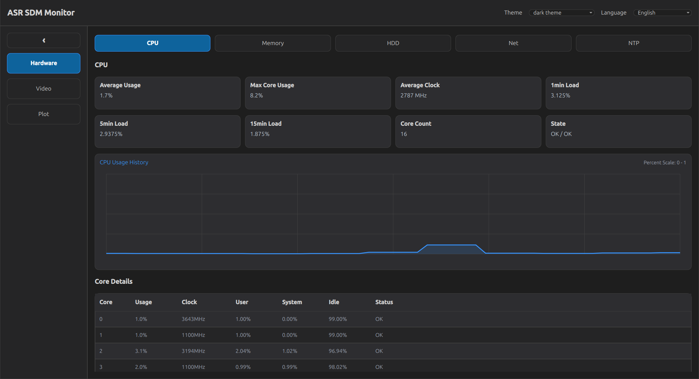
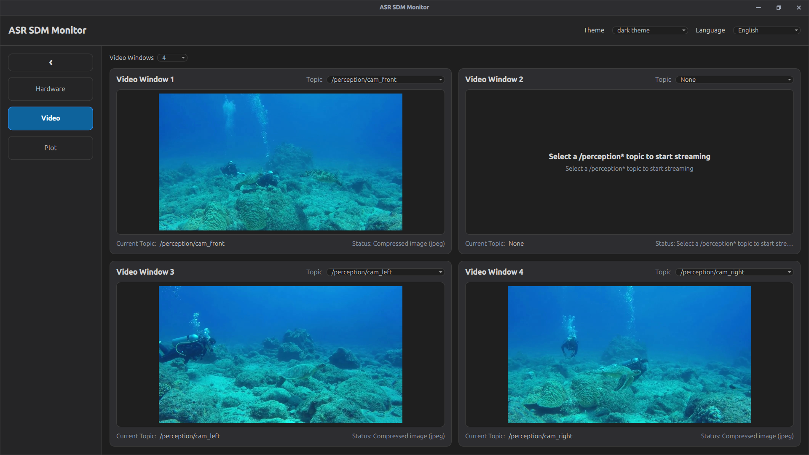
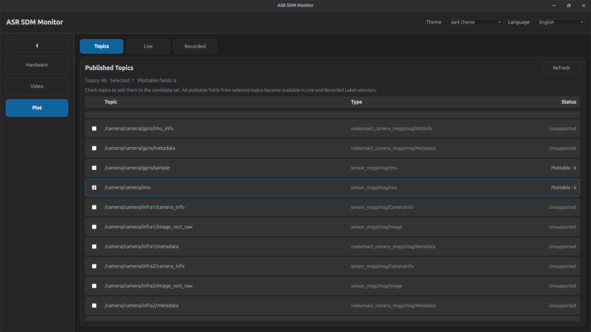
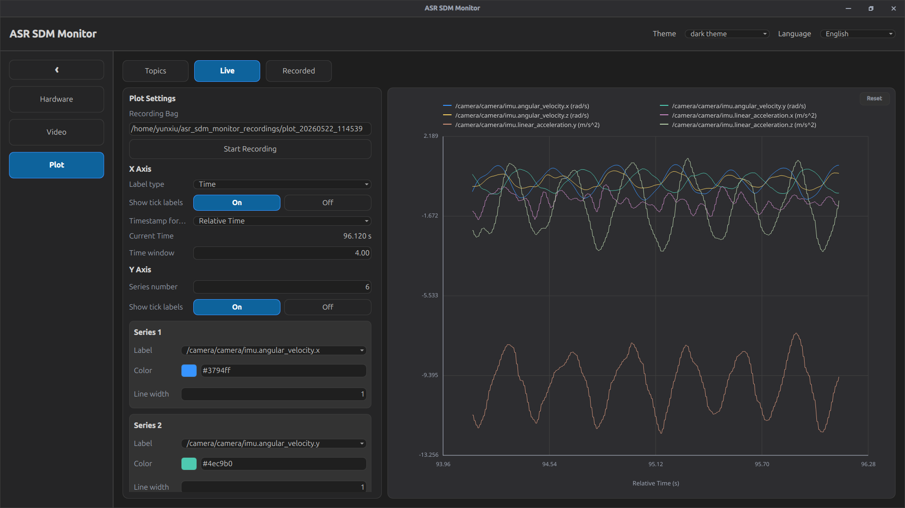
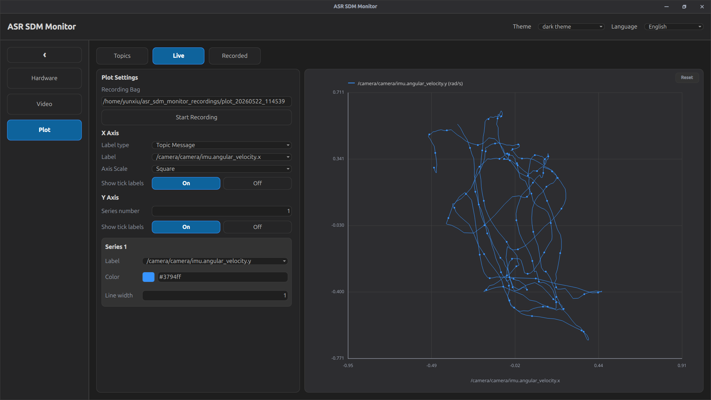
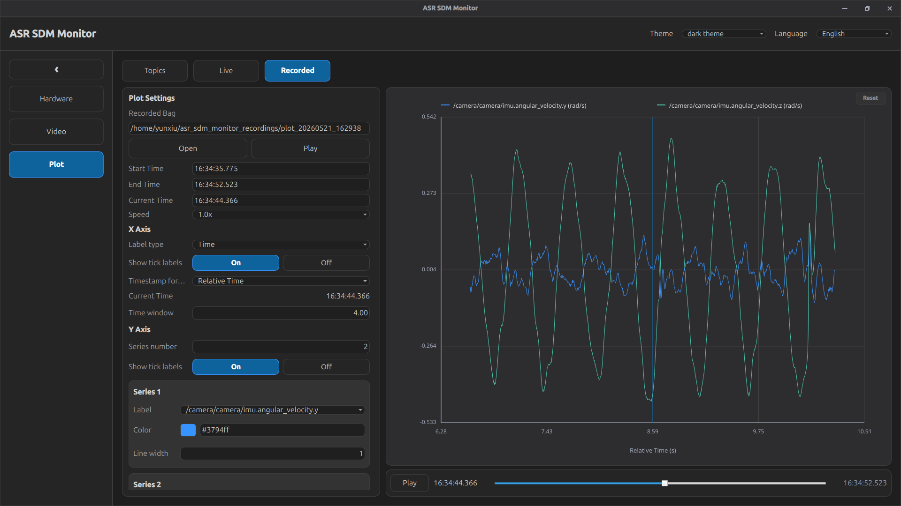

# README

[toc]

The interface is organized into 3 main modules:

- **Hardware**: monitor CPU, memory, disk, network, and NTP information from `/diagnostics`
- **Video**: display `/perception*` image streams in selectable video windows
- **Plot**: select plottable ROS topics, visualize live data, record selected topics, and replay rosbag / MCAP data

The top bar provides **Theme** and **Language** selectors. 

### Quick start

Build the package in a ROS 2 workspace and source the workspace before running the monitor.

```bash
cd ~/ros2_ws
colcon build --packages-select asr_sdm_monitor
source install/setup.bash
ros2 run asr_sdm_monitor asr_sdm_monitor
```

### Hardware

#### Function

The `/diagnostics` topic is published by the monitor nodes from the `ros2_system_monitor` package, including `cpu_monitor`, `mem_monitor`, `hdd_monitor`, `net_monitor`, and `ntp_monitor`.

```bash
cd ~/ros2_ws
colcon build --packages-select ros2_system_monitor
source install/setup.bash
ros2 launch ros2_system_monitor system_monitor.launch.py
```

The **Hardware** module visualizes system status from the ROS 2 `/diagnostics` topic. It listens to diagnostic messages and updates the page when diagnostic status names match the following categories:

- CPU usage
- Memory usage
- HDD usage
- Network usage
- NTP offset

The module contains five tabs: **CPU**, **Memory**, **HDD**, **Net**, and **NTP**. Each tab has summary cards and, when available, a detailed table or history chart.

#### CPU page

The **CPU** page shows CPU usage and per-core information.

Summary cards:

| Item | Meaning |
|---|---|
| **Average Usage** | Average CPU usage across all parsed cores |
| **Max Core Usage** | Highest usage among all parsed CPU cores |
| **Average Clock** | Average CPU clock speed |
| **1min Load** | 1-minute load average |
| **5min Load** | 5-minute load average |
| **15min Load** | 15-minute load average |
| **Core Count** | Number of parsed CPU cores |
| **State** | Diagnostic level and diagnostic message |

Chart:

| Chart | Meaning |
|---|---|
| **CPU Usage History** | Recent average CPU usage history, scaled from 0 to 1 |

Table columns:

| Column | Meaning |
|---|---|
| **Core** | CPU core index |
| **Usage** | Calculated usage of the core |
| **Clock** | Core clock speed |
| **User** | User-space CPU percentage from diagnostics |
| **System** | Kernel/system CPU percentage from diagnostics |
| **Idle** | Idle percentage from diagnostics |
| **Status** | Core status text |

#### Memory page

The **Memory** page shows physical memory, swap memory, and memory history.

Summary cards:

| Item | Meaning |
|---|---|
| **Physical Used** | Used physical memory |
| **Physical Total** | Total physical memory |
| **Physical Free** | Free physical memory |
| **Usage** | Physical memory usage percentage |
| **Swap Used** | Used swap memory |
| **Swap Total** | Total swap memory |
| **Update Status** | Whether the memory information was updated from diagnostics |
| **State** | Diagnostic level and diagnostic message |

Chart:

| Chart | Meaning |
|---|---|
| **Memory Usage History** | Recent memory usage history, scaled from 0 to 1 |

Table columns:

| Column | Meaning |
|---|---|
| **Type** | Memory item type, such as physical, swap, or total |
| **Total** | Total capacity |
| **Used** | Used capacity |
| **Free** | Free capacity |

#### HDD page

The **HDD** page shows disk usage information parsed from diagnostics.

Summary cards:

| Item | Meaning |
|---|---|
| **Disk Count** | Number of parsed disk entries |
| **Max Usage** | Highest disk usage among all entries |
| **Status Level** | Diagnostic level |
| **Status Description** | Diagnostic message |

Table columns:

| Column | Meaning |
|---|---|
| **Disk** | Disk or filesystem name |
| **Mount** | Mount point |
| **Size** | Total size |
| **Available** | Available capacity |
| **Use** | Usage percentage |
| **Status** | Disk status |

#### Net page

The **Net** page shows network traffic, interface status, and traffic history.

Summary cards:

| Item | Meaning |
|---|---|
| **Total Input** | Total input traffic rate |
| **Total Output** | Total output traffic rate |
| **Interface Count** | Number of parsed network interfaces |
| **Error Count** | Total receive and transmit errors |
| **Interface List** | Names of detected interfaces |
| **Status Level** | Diagnostic level |
| **Status Description** | Diagnostic message |

Chart:

| Chart | Meaning |
|---|---|
| **Input History** | Recent input traffic history |
| **Output History** | Recent output traffic history |
| **Current Scale** | Adaptive Y-axis scale in MB/s |

Table columns:

| Column | Meaning |
|---|---|
| **Interface** | Network interface name |
| **State** | Interface state |
| **Input** | Current input traffic rate |
| **Output** | Current output traffic rate |
| **RxErr** | Receive error count |
| **TxErr** | Transmit error count |
| **TotalRx** | Total received data |
| **TotalTx** | Total transmitted data |

#### NTP page

The **NTP** page shows time synchronization information parsed from diagnostics.

Summary cards:

| Item | Meaning |
|---|---|
| **Offset** | Current NTP offset in microseconds |
| **Tolerance** | Allowed offset tolerance |
| **Error Tolerance** | Error-level offset tolerance |
| **State** | Diagnostic level and diagnostic message |

Table columns:

| Column | Meaning |
|---|---|
| **Name** | NTP diagnostic item |
| **Value** | Diagnostic value |


#### Typical workflow

1. Start the system monitor nodes in one terminal.

```bash
cd ~/ros2_ws
colcon build --packages-select ros2_system_monitor
source install/setup.bash
ros2 launch ros2_system_monitor system_monitor.launch.py
```

2. Start the monitor UI in another terminal.

```bash
cd ~/ros2_ws
source install/setup.bash
ros2 run asr_sdm_monitor asr_sdm_monitor
```

3. Open **Hardware** from the sidebar.

4. Use the **CPU** page as a typical example.

   

5. If the page does not update, first confirm that `/diagnostics` is being published.

```bash
ros2 topic echo /diagnostics --once
```


### Video

#### Function

The **Video** module displays image streams from ROS 2 perception topics. The implementation automatically scans the ROS graph and lists topics that satisfy both conditions:

- The topic name starts with `/perception`
- The topic type is `sensor_msgs/msg/Image` or `sensor_msgs/msg/CompressedImage`

Each selected topic is subscribed directly by the monitor and rendered in the corresponding video window. Image display uses aspect-ratio preserving scaling, so the full image remains visible when the window is resized.

#### Buttons and controls

| Control | Function |
|---|---|
| **Video Windows** | Select how many video windows are displayed |
| **1 / 2 / 3 / 4** | Display 1, 2, 3, or 4 video windows |
| **Topic** | Select the image topic for a video window |
| **None** | Disable the video stream for that window |
| **Current Topic** | Show the currently selected topic of the window |
| **Status** | Show whether the window is waiting for frames, receiving images, or has no selected topic |

#### Adjustable parameters

| Parameter | Options / Range | Default | Description |
|---|---:|---:|---|
| **Video Windows** | 1, 2, 3, 4 | 2 | Number of active video windows |
| **Topic** | `None` or discovered `/perception*` image topics | `None` | Image topic shown in each window |

#### Video window behavior

- When no topic is selected, the window displays **Select a /perception* topic to start streaming**.
- When a topic is selected but no image has arrived yet, the window displays **Waiting for video frame ...**.
- When a valid image arrives, the frame is rendered inside the window.
- If the same topic is selected in another window, the previous window is cleared so that one topic is displayed by only one active window.
- If the selected topic disappears from the ROS graph, the monitor clears that video slot and returns it to **None**.
- Hidden windows are cleared automatically when the number of video windows is reduced.

#### Supported image encodings

The monitor supports common raw image encodings handled by the implementation, including:

| Encoding type | Behavior |
|---|---|
| `rgb8` | Displayed as RGB image |
| `bgr8` | Converted to RGB before display |
| `mono8`, `8UC1` | Displayed as grayscale image |
| `rgba8` | Displayed as RGBA image |
| `bgra8` | Converted to RGBA before display |
| Other encodings | Reported as unsupported in the video status |


#### Typical workflow

1. Start the ROS 2 nodes that publish image topics under `/perception*`.

2. Start `asr_sdm_monitor` and open **Video** from the sidebar.

3. Set **Video Windows** to `1`, `2`, `3`, or `4` as needed.

4. In each active video window, use the **Topic** drop-down menu to select one `/perception*` image topic.

   

5. If a window no longer needs to display images, reduce the number of video windows or set the window **Topic** to **None**.

6. If no selectable topic appears, check whether the image topic name starts with `/perception` and whether its type is `sensor_msgs/msg/Image` or `sensor_msgs/msg/CompressedImage`.


### Plot

#### Function

The **Plot** module visualizes numeric fields from selected ROS topics. It supports three subpages:

| Subpage | Function |
|---|---|
| **Topics** | Scan published topics and choose which topics are candidates for plotting |
| **Live** | Plot live data from selected topics and record selected topic messages to a bag |
| **Recorded** | Open a recorded rosbag / MCAP directory and replay plottable data |

The Plot module can work as a time-series plot or as an XY plot:

- **Time-series plot**: X axis is time, Y axis is one or more topic message fields
- **XY plot**: X axis is a selected topic message field, Y axis is one or more topic message fields

For example, if the X axis is `angular_velocity.x` and the Y axis is `angular_velocity.y`, the chart shows the XY relation between the two IMU angular velocity components.

#### Supported topic types

Only topics with supported numeric message types can be plotted or recorded through the Plot UI.

| Message type | Plottable fields |
|---|---|
| `std_msgs/msg/Bool` | topic value, displayed as 0 or 1 |
| `std_msgs/msg/Float32` | topic value |
| `std_msgs/msg/Float64` | topic value |
| `std_msgs/msg/Int8` | topic value |
| `std_msgs/msg/Int16` | topic value |
| `std_msgs/msg/Int32` | topic value |
| `std_msgs/msg/Int64` | topic value |
| `std_msgs/msg/UInt8` | topic value |
| `std_msgs/msg/UInt16` | topic value |
| `std_msgs/msg/UInt32` | topic value |
| `std_msgs/msg/UInt64` | topic value |
| `sensor_msgs/msg/Imu` | `angular_velocity.x/y/z`, `linear_acceleration.x/y/z` |
| `sensor_msgs/msg/Temperature` | `temperature`, `variance` |
| `sensor_msgs/msg/FluidPressure` | `fluid_pressure`, `variance` |
| `sensor_msgs/msg/RelativeHumidity` | `relative_humidity`, `variance` |
| `sensor_msgs/msg/MagneticField` | `magnetic_field.x/y/z` |
| `sensor_msgs/msg/BatteryState` | `voltage`, `temperature`, `current`, `charge`, `capacity`, `design_capacity`, `percentage` |
| `geometry_msgs/msg/Vector3` | `x`, `y`, `z` |
| `geometry_msgs/msg/Vector3Stamped` | `x`, `y`, `z` |
| `geometry_msgs/msg/Twist` | `linear.x/y/z`, `angular.x/y/z` |
| `geometry_msgs/msg/TwistStamped` | `linear.x/y/z`, `angular.x/y/z` |
| `geometry_msgs/msg/Accel` | `linear.x/y/z`, `angular.x/y/z` |
| `geometry_msgs/msg/AccelStamped` | `linear.x/y/z`, `angular.x/y/z` |

#### Topics subpage

The **Topics** subpage is used to build the candidate topic set for plotting.

Buttons and controls:

| Control | Function |
|---|---|
| **Refresh** | Scan the ROS graph again and refresh the topic list |
| **Checkbox** | Add or remove a topic from the plotting candidate set |
| **Topic Name** | Display the ROS topic name |
| **Topic Type** | Display the ROS message type |
| **Status** | Show whether the topic is plottable and how many fields it provides |

Status meanings:

| Status | Meaning |
|---|---|
| **Plottable · N** | The topic type is supported and provides `N` numeric fields |
| **Unsupported** | The topic exists but its message type is not supported by the Plot module |

Notes:

- Only checked plottable topics appear in the **Live** and **Recorded** label selectors.
- When the selected topic set changes, live plot samples are cleared and subscriptions are refreshed.
- The topic list is also refreshed automatically by the backend topic discovery timer.

#### Live subpage

The **Live** subpage displays real-time samples from the selected topic set.

Buttons and controls:

| Control | Function |
|---|---|
| **Recording Bag** | Path where a new recording bag will be saved |
| **Start Recording** | Start recording selected live topic messages to a bag |
| **Stop Recording** | Stop the active recording and close the bag writer |
| **X Axis settings** | Configure the X-axis data source and display style |
| **Y Axis settings** | Configure the number of curves and each curve style |
| **Reset** | Reset the chart view after zooming or panning |

Recording behavior:

- The default recording directory is `~/asr_sdm_monitor_recordings`.
- The default bag name format is `plot_yyyyMMdd_HHmmss`.
- If the path field is empty, the monitor generates a default path.
- If the target path already exists, recording will not start.
- Only messages from selected plottable topics are recorded.
- The status text shows the recording path and message count while recording.

#### Recorded subpage

The **Recorded** subpage loads and replays recorded rosbag / MCAP data.

Buttons and controls:

| Control | Function |
|---|---|
| **Recorded Bag** | Path of the recorded bag / MCAP directory |
| **Open** | Open a folder dialog and choose a recorded bag directory |
| **Play** | Start playback from the current time |
| **Pause** | Pause playback |
| **Start Time** | Set the start boundary of playback |
| **End Time** | Set the end boundary of playback |
| **Current Time** | Set the current playback time |
| **Speed** | Set playback speed |
| **Playback slider** | Drag to adjust the current playback time |

Adjustable playback parameters:

| Parameter | Options / Range | Description |
|---|---:|---|
| **Start Time** | Inside the bag time range | Playback cannot go before this time |
| **End Time** | Inside the bag time range | Playback stops at this time |
| **Current Time** | Between Start Time and End Time | Current replay position |
| **Speed** | 0.25x, 0.5x, 1.0x, 2.0x, 4.0x in the UI | Playback speed multiplier |

Time input formats:

| Format | Meaning |
|---|---|
| `HH:MM:SS.mmm` | Absolute wall-clock time on the same date as the current fallback time |
| Large numeric timestamp | Treated as absolute milliseconds |
| Small numeric value | Treated as seconds relative to playback start time |

Playback behavior:

- When a bag is loaded successfully, the module switches to **Recorded** data source.
- When playback reaches **End Time**, it stops automatically.
- If **Play** is pressed after playback has reached the end, playback restarts from **Start Time**.
- The chart shows a vertical playback marker in time-series mode.
- The playback slider and **Current Time** field update the visible time window.

#### X Axis settings

| Parameter | Options / Range | Default | Description |
|---|---:|---:|---|
| **Label type** | `Time`, `Topic Message` | `Time` | Select whether the X axis uses time or a topic field |
| **Label** | Selected plottable field | First available field when needed | Used only when **Label type** is `Topic Message` |
| **Show tick labels** | `On`, `Off` | `On` | Show or hide X-axis tick labels |
| **Timestamp format** | `Relative Time`, `Absolute Time` | `Relative Time` | Used only when **Label type** is `Time` |
| **Current Time** | Display only in Live; editable through playback controls in Recorded | Current live or playback time | Shows current reference time |
| **Time window** | Positive number, minimum 0.05 s | 4.00 s | Time span shown in time-series mode |

#### Y Axis settings

| Parameter | Options / Range | Default | Description |
|---|---:|---:|---|
| **Series number** | 1 to 16 | 1 | Number of curves to draw |
| **Show tick labels** | `On`, `Off` | `On` | Show or hide Y-axis tick labels |
| **Series Label** | `None` or selected plottable field | `None` | Field used by this curve |
| **Series Color** | Color dialog or text value | Automatic palette color | Color of the curve |
| **Line width** | Positive number, minimum 0.1 | 1.0 | Width of the curve line |

Series behavior:

- Each Y-axis series has independent **Label**, **Color**, and **Line width** controls.
- The same topic field cannot be selected by multiple Y-axis series at the same time.
- If a selected field disappears, the corresponding series is cleared.
- Only series with valid fields are drawn.

#### Chart mouse operations

| Operation | Function |
|---|---|
| Mouse wheel | Zoom in or out around the mouse position |
| Left mouse drag | Pan the chart view |
| **Reset** | Restore the automatic chart view |

#### Axis scale

The implementation contains an axis scale mode property used by the chart:

| Mode | Function |
|---|---|
| **Independent** | X and Y axes scale independently |
| **Square** | In XY mode, X and Y use the same numeric range so geometric shape is preserved |

#### Typical workflow

1. Open **Plot** from the sidebar.

2. Go to **Topics** and click **Refresh** if the topic list needs to be updated.

3. Check the plottable topics that should be used by the plot module.

   

4. Go to **Live** for real-time visualization.

5. For a time-series plot, set **X Axis / Label type** to `Time`, choose **Relative Time** or **Absolute Time**, and adjust **Time window**.

   

6. For an XY plot, set **X Axis / Label type** to `Topic Message`, then choose the X-axis topic field.

   

7. Set **Series number** and select one Y-axis field for each curve.

8. Adjust **Series Color** and **Line width** when different curves need to be distinguished.

9. Use the mouse wheel to zoom the chart view, left mouse drag to pan the chart view, and **Reset** to restore the automatic chart view.

10. To record live data, set **Recording Bag**, click **Start Recording**, then click **Stop Recording** when finished.

11. To replay data, go to **Recorded**, click **Open**, and select a rosbag / MCAP directory.

12. Set **Start Time**, **End Time**, **Current Time**, and **Speed** as needed.

13. Click **Play** to replay the selected time range, or click **Pause** to pause playback.

    

14. After playback reaches **End Time**, click **Play** again to restart from **Start Time**.


---

### 快速开始

在 ROS 2 workspace 中编译 package，并 source workspace 后启动 monitor。

```bash
cd ~/ros2_ws
colcon build --packages-select asr_sdm_monitor
source install/setup.bash
ros2 run asr_sdm_monitor asr_sdm_monitor
```

### Hardware

#### 功能

`/diagnostics` 话题由 `ros2_system_monitor` package 中的多个监测节点发布，包括 `cpu_monitor`、`mem_monitor`、`hdd_monitor`、`net_monitor`, `ntp_monitor`。 

启动`ros2_system_monitor`

```bash
cd ~/ros2_ws
colcon build --packages-select ros2_system_monitor
source install/setup.bash
ros2 launch ros2_system_monitor system_monitor.launch.py
```

**Hardware** 模块用于显示 ROS 2 `/diagnostics` 话题中的系统诊断信息。程序会订阅 `/diagnostics`，并根据 diagnostic status 的名称解析下面几类信息：

- CPU usage
- Memory usage
- HDD usage
- Network usage
- NTP offset

该模块包含五个子页面：**CPU**、**Memory**、**HDD**、**Net**、**NTP**。每个页面包含概要卡片，部分页面还包含历史曲线或详细表格。

#### CPU 页面

**CPU** 页面显示 CPU 占用、负载、主频和每个核心的详细信息。

概要卡片：

| 项目 | 含义 |
|---|---|
| **Average Usage** | 所有解析到的 CPU 核心的平均占用率 |
| **Max Core Usage** | 所有 CPU 核心中的最高占用率 |
| **Average Clock** | 平均 CPU 主频 |
| **1min Load** | 1 分钟平均负载 |
| **5min Load** | 5 分钟平均负载 |
| **15min Load** | 15 分钟平均负载 |
| **Core Count** | 解析到的 CPU 核心数量 |
| **State** | diagnostic level 和 diagnostic message |

曲线：

| 曲线 | 含义 |
|---|---|
| **CPU Usage History** | 最近一段时间的 CPU 平均占用率历史，纵轴范围 0 到 1 |

表格列：

| 列名 | 含义 |
|---|---|
| **Core** | CPU 核心编号 |
| **Usage** | 计算得到的核心占用率 |
| **Clock** | 核心主频 |
| **User** | diagnostics 中的用户态 CPU 百分比 |
| **System** | diagnostics 中的系统态 CPU 百分比 |
| **Idle** | diagnostics 中的空闲百分比 |
| **Status** | 核心状态文本 |

#### Memory 页面

**Memory** 页面显示物理内存、交换分区和内存占用历史。

概要卡片：

| 项目 | 含义 |
|---|---|
| **Physical Used** | 已使用的物理内存 |
| **Physical Total** | 物理内存总量 |
| **Physical Free** | 空闲物理内存 |
| **Usage** | 物理内存使用率 |
| **Swap Used** | 已使用的交换分区 |
| **Swap Total** | 交换分区总量 |
| **Update Status** | 内存信息是否从 diagnostics 更新 |
| **State** | diagnostic level 和 diagnostic message |

曲线：

| 曲线 | 含义 |
|---|---|
| **Memory Usage History** | 最近一段时间的内存使用率历史，纵轴范围 0 到 1 |

表格列：

| 列名 | 含义 |
|---|---|
| **Type** | 内存类型，例如 physical、swap 或 total |
| **Total** | 总量 |
| **Used** | 已用量 |
| **Free** | 空闲量 |

#### HDD 页面

**HDD** 页面显示磁盘使用信息。

概要卡片：

| 项目 | 含义 |
|---|---|
| **Disk Count** | 解析到的磁盘条目数量 |
| **Max Usage** | 所有磁盘条目中的最高使用率 |
| **Status Level** | diagnostic level |
| **Status Description** | diagnostic message |

表格列：

| 列名 | 含义 |
|---|---|
| **Disk** | 磁盘或文件系统名称 |
| **Mount** | 挂载点 |
| **Size** | 总容量 |
| **Available** | 可用容量 |
| **Use** | 使用率 |
| **Status** | 磁盘状态 |

#### Net 页面

**Net** 页面显示网络流量、网络接口状态和流量历史。

概要卡片：

| 项目 | 含义 |
|---|---|
| **Total Input** | 总输入流量速率 |
| **Total Output** | 总输出流量速率 |
| **Interface Count** | 解析到的网络接口数量 |
| **Error Count** | 接收错误和发送错误总数 |
| **Interface List** | 检测到的网络接口名称 |
| **Status Level** | diagnostic level |
| **Status Description** | diagnostic message |

曲线：

| 曲线 | 含义 |
|---|---|
| **Input History** | 输入流量历史 |
| **Output History** | 输出流量历史 |
| **Current Scale** | 自适应纵轴量程，单位 MB/s |

表格列：

| 列名 | 含义 |
|---|---|
| **Interface** | 网络接口名称 |
| **State** | 接口状态 |
| **Input** | 当前输入流量速率 |
| **Output** | 当前输出流量速率 |
| **RxErr** | 接收错误数 |
| **TxErr** | 发送错误数 |
| **TotalRx** | 累计接收数据 |
| **TotalTx** | 累计发送数据 |

#### NTP 页面

**NTP** 页面显示时间同步相关信息。

概要卡片：

| 项目 | 含义 |
|---|---|
| **Offset** | 当前 NTP 偏移，单位微秒 |
| **Tolerance** | 允许的偏移容差 |
| **Error Tolerance** | Error 级别的偏移容差 |
| **State** | diagnostic level 和 diagnostic message |

表格列：

| 列名 | 含义 |
|---|---|
| **Name** | NTP 诊断项目 |
| **Value** | 对应的诊断值 |


#### 典型使用流程

1. 在一个终端中启动 system monitor 节点。

```bash
cd ~/ros2_ws
colcon build --packages-select ros2_system_monitor
source install/setup.bash
ros2 launch ros2_system_monitor system_monitor.launch.py
```

2. 在另一个终端中启动 monitor UI。

```bash
cd ~/ros2_ws
source install/setup.bash
ros2 run asr_sdm_monitor asr_sdm_monitor
```

3. 在侧边栏打开 **Hardware**。

4. 以 **CPU** 页面作为典型示例。

   

5. 如果页面没有刷新，先确认 `/diagnostics` 是否正在发布。

```bash
ros2 topic echo /diagnostics --once
```


### Video

#### 功能

**Video** 模块用于显示 ROS 2 图像话题。程序会自动扫描 ROS graph，并列出同时满足下面两个条件的话题：

- 话题名以 `/perception` 开头
- 话题类型是 `sensor_msgs/msg/Image` 或 `sensor_msgs/msg/CompressedImage`

每个窗口会直接订阅所选图像话题并渲染图像。图像显示采用保持长宽比的缩放方式，因此窗口大小变化时不会拉伸变形。

#### 按钮和控件

| 控件 | 作用 |
|---|---|
| **Video Windows** | 选择显示几个视频窗口 |
| **1 / 2 / 3 / 4** | 显示 1、2、3 或 4 个视频窗口 |
| **Topic** | 为某个视频窗口选择图像话题 |
| **None** | 关闭该窗口的视频显示 |
| **Current Topic** | 显示该窗口当前选择的话题 |
| **Status** | 显示该窗口是等待图像、正在接收图像，还是没有选择话题 |

#### 可以设置的参数

| 参数 | 选项 / 范围 | 默认值 | 说明 |
|---|---:|---:|---|
| **Video Windows** | 1, 2, 3, 4 | 2 | 当前显示的视频窗口数量 |
| **Topic** | `None` 或扫描到的 `/perception*` 图像话题 | `None` | 每个窗口显示的图像话题 |

#### 视频窗口行为

- 没有选择话题时，窗口显示 **Select a /perception* topic to start streaming**。
- 选择了话题但还没有收到图像时，窗口显示 **Waiting for video frame ...**。
- 收到有效图像后，图像会显示在窗口中。
- 如果同一个话题被选择到另一个窗口，原来的窗口会被清空，避免一个话题同时占用多个窗口。
- 如果所选话题从 ROS graph 中消失，该窗口会自动恢复为 **None**。
- 当视频窗口数量减少时，被隐藏的窗口会自动清空。

#### 支持的图像编码

monitor 支持实现中处理的常见 raw image encoding：

| Encoding 类型 | 行为 |
|---|---|
| `rgb8` | 作为 RGB 图像显示 |
| `bgr8` | 转换为 RGB 后显示 |
| `mono8`, `8UC1` | 作为灰度图显示 |
| `rgba8` | 作为 RGBA 图像显示 |
| `bgra8` | 转换为 RGBA 后显示 |
| 其他 encoding | 在视频状态中显示为 unsupported |

#### 典型使用流程

1. 启动会发布 `/perception*` 图像话题的 ROS 2 节点。

2. 启动 `asr_sdm_monitor`，并在侧边栏打开 **Video**。

3. 根据需要把 **Video Windows** 设置为 `1`、`2`、`3` 或 `4`。

4. 在每个启用的视频窗口中，通过 **Topic** 下拉菜单选择一个 `/perception*` 图像话题。

   

5. 如果某个窗口不再需要显示图像，可以减少窗口数量，或把该窗口的 **Topic** 设为 **None**。

6. 如果没有出现可选话题，检查图像话题名称是否以 `/perception` 开头，并确认类型是 `sensor_msgs/msg/Image` 或 `sensor_msgs/msg/CompressedImage`。


### Plot

#### 功能

**Plot** 模块用于可视化所选 ROS topic 中的数值字段。它包含三个子页面：

| 子页面 | 功能 |
|---|---|
| **Topics** | 扫描正在发布的话题，并选择可用于绘图的候选 topic |
| **Live** | 显示所选 topic 的实时数据，并可以录制为 bag |
| **Recorded** | 打开 rosbag / MCAP 目录，并回放其中可绘图的数据 |

Plot 模块支持两种绘图方式：

- **时间序列图**：X 轴是时间，Y 轴是一个或多个 topic message 字段
- **XY 图**：X 轴是一个 topic message 字段，Y 轴是一个或多个 topic message 字段

例如 X 轴选择 `angular_velocity.x`，Y 轴选择 `angular_velocity.y` 时，图中显示的是 IMU 角速度两个分量之间的 XY 关系。

#### 支持的话题类型

只有支持的数值消息类型可以在 Plot 中绘制或通过 Plot UI 录制。

| Message type | 可绘制字段 |
|---|---|
| `std_msgs/msg/Bool` | topic value，以 0 或 1 显示 |
| `std_msgs/msg/Float32` | topic value |
| `std_msgs/msg/Float64` | topic value |
| `std_msgs/msg/Int8` | topic value |
| `std_msgs/msg/Int16` | topic value |
| `std_msgs/msg/Int32` | topic value |
| `std_msgs/msg/Int64` | topic value |
| `std_msgs/msg/UInt8` | topic value |
| `std_msgs/msg/UInt16` | topic value |
| `std_msgs/msg/UInt32` | topic value |
| `std_msgs/msg/UInt64` | topic value |
| `sensor_msgs/msg/Imu` | `angular_velocity.x/y/z`, `linear_acceleration.x/y/z` |
| `sensor_msgs/msg/Temperature` | `temperature`, `variance` |
| `sensor_msgs/msg/FluidPressure` | `fluid_pressure`, `variance` |
| `sensor_msgs/msg/RelativeHumidity` | `relative_humidity`, `variance` |
| `sensor_msgs/msg/MagneticField` | `magnetic_field.x/y/z` |
| `sensor_msgs/msg/BatteryState` | `voltage`, `temperature`, `current`, `charge`, `capacity`, `design_capacity`, `percentage` |
| `geometry_msgs/msg/Vector3` | `x`, `y`, `z` |
| `geometry_msgs/msg/Vector3Stamped` | `x`, `y`, `z` |
| `geometry_msgs/msg/Twist` | `linear.x/y/z`, `angular.x/y/z` |
| `geometry_msgs/msg/TwistStamped` | `linear.x/y/z`, `angular.x/y/z` |
| `geometry_msgs/msg/Accel` | `linear.x/y/z`, `angular.x/y/z` |
| `geometry_msgs/msg/AccelStamped` | `linear.x/y/z`, `angular.x/y/z` |

#### Topics 子页面

**Topics** 子页面用于构建绘图候选 topic 集合。

按钮和控件：

| 控件 | 作用 |
|---|---|
| **Refresh** | 重新扫描 ROS graph 并刷新 topic 列表 |
| **Checkbox** | 将某个 topic 加入或移出绘图候选集合 |
| **Topic Name** | 显示 ROS topic 名称 |
| **Topic Type** | 显示 ROS message type |
| **Status** | 显示该 topic 是否可绘图，以及有多少个可绘制字段 |

状态含义：

| 状态 | 含义 |
|---|---|
| **Plottable · N** | 该 topic 类型支持绘图，并提供 `N` 个数值字段 |
| **Unsupported** | topic 存在，但消息类型当前不支持绘图 |

说明：

- 只有被勾选的可绘图 topic，才会出现在 **Live** 和 **Recorded** 的 Label 下拉菜单中。
- 当候选 topic 集合发生变化时，实时绘图缓存会被清空，订阅会重新刷新。
- topic 列表也会由后端定时自动刷新。

#### Live 子页面

**Live** 子页面用于显示所选 topic 的实时数据。

按钮和控件：

| 控件 | 作用 |
|---|---|
| **Recording Bag** | 新录制 bag 的保存路径 |
| **Start Recording** | 开始把所选实时 topic 消息录制到 bag |
| **Stop Recording** | 停止当前录制并关闭 bag writer |
| **X Axis settings** | 设置 X 轴数据来源和显示方式 |
| **Y Axis settings** | 设置曲线数量和每条曲线的显示方式 |
| **Reset** | 鼠标缩放或拖动后恢复自动视野 |

录制行为：

- 默认录制目录是 `~/asr_sdm_monitor_recordings`。
- 默认 bag 名称格式是 `plot_yyyyMMdd_HHmmss`。
- 如果路径为空，monitor 会自动生成默认路径。
- 如果目标路径已经存在，录制不会开始。
- 只有已勾选的可绘图 topic 会被录制。
- 录制过程中状态栏会显示录制路径和消息数量。

#### Recorded 子页面

**Recorded** 子页面用于加载和回放 rosbag / MCAP 数据。

按钮和控件：

| 控件 | 作用 |
|---|---|
| **Recorded Bag** | 已录制 rosbag / MCAP 目录路径 |
| **Open** | 打开文件夹选择对话框，选择 bag 目录 |
| **Play** | 从当前时间开始播放 |
| **Pause** | 暂停播放 |
| **Start Time** | 设置回放起始边界 |
| **End Time** | 设置回放结束边界 |
| **Current Time** | 设置当前回放时间 |
| **Speed** | 设置播放速度 |
| **Playback slider** | 拖动调整当前回放时间 |

可设置的回放参数：

| 参数 | 选项 / 范围 | 说明 |
|---|---:|---|
| **Start Time** | bag 时间范围内 | 回放不会早于该时间 |
| **End Time** | bag 时间范围内 | 回放到该时间后停止 |
| **Current Time** | Start Time 和 End Time 之间 | 当前回放位置 |
| **Speed** | UI 中提供 0.25x、0.5x、1.0x、2.0x、4.0x | 回放速度倍率 |

时间输入格式：

| 格式 | 含义 |
|---|---|
| `HH:MM:SS.mmm` | 使用当前 fallback date 上的绝对时刻 |
| 很大的数字时间戳 | 作为绝对毫秒时间 |
| 较小的数字 | 作为相对 playback start time 的秒数 |

回放行为：

- bag 成功加载后，模块会切换到 **Recorded** 数据源。
- 当回放到 **End Time** 时会自动停止。
- 如果回放已经结束，再点击 **Play**，会从 **Start Time** 重新播放。
- 时间序列图中会显示一条垂直的当前回放时间标记线。
- 底部进度条和 **Current Time** 字段都会影响当前可视时间窗口。

#### X Axis 设置

| 参数 | 选项 / 范围 | 默认值 | 说明 |
|---|---:|---:|---|
| **Label type** | `Time`, `Topic Message` | `Time` | 选择 X 轴使用时间还是 topic 字段 |
| **Label** | 已选择 topic 的可绘图字段 | 需要时使用第一个可用字段 | 只在 **Label type** 为 `Topic Message` 时使用 |
| **Show tick labels** | `On`, `Off` | `On` | 是否显示 X 轴刻度标签 |
| **Timestamp format** | `Relative Time`, `Absolute Time` | `Relative Time` | 只在 **Label type** 为 `Time` 时使用 |
| **Current Time** | Live 中仅显示；Recorded 中通过回放控件编辑 | 当前实时或回放时间 | 显示当前参考时间 |
| **Time window** | 正数，最小 0.05 s | 4.00 s | 时间序列图中显示的时间跨度 |

#### Y Axis 设置

| 参数 | 选项 / 范围 | 默认值 | 说明 |
|---|---:|---:|---|
| **Series number** | 1 到 16 | 1 | 要绘制的曲线数量 |
| **Show tick labels** | `On`, `Off` | `On` | 是否显示 Y 轴刻度标签 |
| **Series Label** | `None` 或已选择 topic 的可绘图字段 | `None` | 该曲线使用的字段 |
| **Series Color** | 颜色对话框或文本颜色值 | 自动颜色 | 曲线颜色 |
| **Line width** | 正数，最小 0.1 | 1.0 | 曲线线宽 |

曲线行为：

- 每条 Y 轴曲线都可以独立设置 **Label**、**Color** 和 **Line width**。
- 同一个 topic 字段不能同时被多个 Y 轴 series 重复选择。
- 如果已选择字段消失，对应曲线会被清空。
- 只有选择了有效字段的 series 才会被绘制。

#### 曲线鼠标操作

| 操作 | 作用 |
|---|---|
| 鼠标滚轮 | 以鼠标位置为中心放大或缩小曲线视野 |
| 鼠标左键拖动 | 平移曲线视野 |
| Reset | 恢复自动视野 |

#### 坐标轴比例

实现中包含一个坐标轴比例模式属性：

| 模式 | 作用 |
|---|---|
| **Independent** | X 轴和 Y 轴独立缩放 |
| **Square** | XY 图中让 X 轴和 Y 轴使用相同数值范围，保持几何形状比例 |

#### 典型使用流程

1. 在侧边栏打开 **Plot**。

2. 进入 **Topics**，必要时点击 **Refresh** 刷新 topic 列表。

3. 勾选需要用于绘图的 plottable topics。

   

4. 进入 **Live** 查看实时数据。

5. 如果需要时间序列图，把 **X Axis / Label type** 设置为 `Time`，选择 **Relative Time** 或 **Absolute Time**，并调整 **Time window**。

   

6. 如果需要 XY 图，把 **X Axis / Label type** 设置为 `Topic Message`，然后选择 X 轴使用的 topic 字段。

   

7. 设置 **Series number**，并为每条曲线选择一个 Y 轴字段。

8. 需要区分多条曲线时，可以调整 **Series Color** 和 **Line width**。

9. 使用鼠标滚轮缩放曲线视野，使用鼠标左键拖动平移视野，点击 **Reset** 恢复自动视野。

10. 如果需要录制实时数据，设置 **Recording Bag**，点击 **Start Recording**，结束后点击 **Stop Recording**。

11. 如果需要回放数据，进入 **Recorded**，点击 **Open**，选择 rosbag / MCAP 目录。

12. 根据需要设置 **Start Time**、**End Time**、**Current Time** 和 **Speed**。

13. 点击 **Play** 回放选定时间范围，点击 **Pause** 暂停。

    

14. 当回放到 **End Time** 后，再次点击 **Play** 会从 **Start Time** 重新播放。
